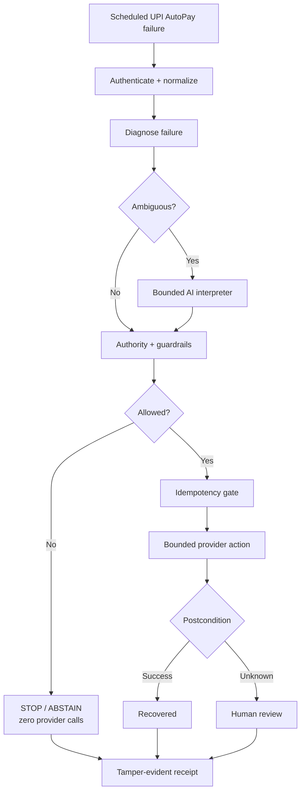

<div align="center">

# 🛡️ MandateGuard

### Safe AI Revenue Recovery for Scheduled UPI AutoPay

**Retry when authority is clear. Stop when it is not. Escalate uncertainty. Prove every decision.**

Razorpay AI Buildathon · **Track 03 — AI Revenue Recovery**

[](https://mandateguard-policy-lab.vercel.app)
[](https://youtu.be/4HrqVRbIYqw)
[](https://www.python.org/)
[](LICENSE)

</div>

---

## Overview

A failed scheduled UPI AutoPay payment should not automatically mean **retry**.

MandateGuard evaluates a failed payment and makes one of three decisions:

| Decision | Meaning |
|---|---|
| **Retry** | Recovery is eligible and deterministic authority checks permit one bounded action |
| **Stop** | Mandate, consent, retry limits, timing, or authority blocks execution before the provider |
| **Human review** | The outcome is uncertain, so the system prevents a blind repeat |

> **AI interprets unclear failure information; deterministic controls decide whether an action is allowed.**

MandateGuard does not try to replace Razorpay's existing recovery products. It demonstrates a **trust, safety, and evidence layer around recovery policy**.

---

## 🎥 Project video

<div align="center">

[](https://youtu.be/4HrqVRbIYqw)

**Explanation / Demo Video:** https://youtu.be/4HrqVRbIYqw

</div>

---

## 🚀 Live demo

**https://mandateguard-policy-lab.vercel.app**

Recommended flow:

1. Click **Run recovery demonstration**.
2. Inspect the **Retry**, **Stop**, and **Human review** cases.
3. Open a decision receipt.
4. Run **Verify audit chain + tamper check**.
5. Compare recovered value with recovery forgone.
6. Inspect the separate Razorpay Test Mode evidence.
7. Expand **Advanced policy evaluation** for the complete benchmark.

> Demo INR values are synthetic. The public demo does not contact customers or execute a real AutoPay debit.

---

## How it works



The deterministic layer checks:

- mandate state;
- consent / opt-out state;
- retry budget;
- retry timing and pre-debit state;
- amount ceiling;
- action class;
- authority expiry;
- case and mandate identity.

The AI interpreter has **no provider tools**. It can help normalize ambiguous failure information, but it cannot restore a mandate, increase limits, refill attempts, extend authority, or bypass consent.

---

## Key features

| Feature | What it provides |
|---|---|
| Failure normalization | Converts provider-shaped failures into a consistent recovery event |
| Bounded AI interpretation | AI is used only for ambiguous/conflicting failure information |
| Deterministic guardrails | Hard controls authorize or deny execution |
| Safe stopping | Denied/abstained paths prove `provider_calls = 0` |
| Idempotency | Exact replay does not create a second provider action |
| Unknown-write handling | `UNKNOWN_POSTCONDITION` routes to review instead of blind retry |
| Audit receipts | Case-level hashes, call IDs, controls, idempotency data, and postconditions |
| Tamper detection | Browser-side audit-chain verification detects edited evidence |
| Policy evaluation | Nine recovery policies run against the same frozen outcome ledger |
| Razorpay proof | Separate saved Razorpay Test Mode provider evidence |

---

## 📊 Evaluation snapshot

<!-- BEGIN GENERATED SUBMISSION METRICS -->
<!-- Generated by scripts/build_showcase.py from outputs/showcase_batch.json and outputs/manifest.json. -->
The interactive example uses **100 cases**, seed **1701**, transient regime, guarded B3 workflow.

| Measured in the demo batch | Result |
|---|---:|
| Simulated recovered INR | 7,944 |
| Simulated provider calls | 18 |
| Cases routed to human review | 6 |
| Protected value by denial, synthetic INR | 26,856 |
| Legitimate recovery forgone, synthetic INR | 29,054 |
| Realized harm, synthetic INR | 0 |

The final evaluation covers **54,000 policy decisions** across **20 seeds**, **3 regimes**, and **9 policies**.
<!-- END GENERATED SUBMISSION METRICS -->

The benchmark reports both **recovery** and the **cost of restraint**. There is no universal winning policy: weaker controls can recover more but may execute prohibited actions; stronger controls can protect safety while forgoing legitimate recovery.

<p align="center">
  
  
</p>

---

## Razorpay Test Mode evidence

Provider proof is intentionally separate from the synthetic benchmark.

MandateGuard includes saved Razorpay **Test Mode** evidence for a Standard Payment Link fallback and independently verified captured-payment evidence.

- Link creation alone is **not** counted as recovered money.
- The Payment Link fallback is **not** presented as a production AutoPay retry.
- The already-paid case proves no new fallback write.

See [`RECOVERYTRUTH.md`](RECOVERYTRUTH.md).

---

## Tech stack

| Area | Technology |
|---|---|
| Backend | Python 3.11+, FastAPI, Uvicorn |
| Recovery engine | Python |
| Frontend | HTML, CSS, JavaScript |
| Tests | Pytest, Hypothesis, HTTPX |
| Evaluation | Matplotlib |
| Optional AI | OpenAI-compatible API |
| Deployment | Vercel, Docker |
| CI | GitHub Actions |

The normal demo requires **no API keys**.

---

# Local setup

## 1. Clone

```bash
git clone https://github.com/Akshu1245/razropay.git
cd razropay
```

## 2. Create a virtual environment

**Windows PowerShell**

```powershell
python -m venv .venv
.\.venv\Scripts\Activate.ps1
```

**macOS / Linux**

```bash
python3 -m venv .venv
source .venv/bin/activate
```

## 3. Install dependencies

```bash
pip install --upgrade pip
pip install -r requirements.txt
```

## 4. Start MandateGuard

```bash
python -m uvicorn api.index:app --host 127.0.0.1 --port 8765
```

Open:

**http://127.0.0.1:8765**

Health endpoint:

**http://127.0.0.1:8765/api/health**

Expected mode:

```json
{
  "status": "ok",
  "mode": "local_simulator"
}
```

### Windows shortcut

```powershell
.\run_showcase.bat
```

---

## Docker

```bash
docker build -t mandateguard .
docker run --rm -p 8765:8765 mandateguard
```

Then open **http://127.0.0.1:8765**.

The container runs the same FastAPI + `public/` judge application in offline mode.

---

## Tests and evidence reproduction

Run the test suite:

```bash
pytest -q
```

Core submission workflow:

```bash
bash scripts/test.sh
bash scripts/demo.sh
bash scripts/evaluate.sh
```

Full verification:

```bash
python scripts/build_showcase.py
python scripts/recoverytruth_check.py
python scripts/security_regression_check.py
python scripts/hardening_check.py
python scripts/claims_check.py
python scripts/mutation_check.py
bash scripts/verify_all.sh
```

On Windows, use Git Bash/WSL for the `.sh` scripts or run the Python checks directly.

---

## Optional live AI interpreter

The final benchmark uses the deterministic offline interpreter for reproducibility.

For an optional OpenAI-compatible model, copy `.env.example` and configure:

```text
OPENAI_API_KEY=
MANDATEGUARD_INTERPRETER_BASE_URL=
MANDATEGUARD_INTERPRETER_MODEL=
```

The model remains an **interpretation service only**. Deterministic controls still authorize execution.

Never commit real credentials.

---

## How we built it

MandateGuard was built around progressively stronger safety boundaries:

1. **Normalize failures** into a canonical recovery event.
2. **Separate diagnosis from authority** so a retryable-looking reason cannot override mandate state.
3. **Add deterministic guardrails** for consent, timing, attempts, amount, and expiry.
4. **Use AI only for ambiguity**, with abstention allowed.
5. **Add idempotent provider execution** and explicit postconditions.
6. **Treat unknown provider results as unknown**, routing them to human review.
7. **Make refusals provable** with zero-call evidence.
8. **Hash-chain decision receipts** for tamper detection.
9. **Evaluate all policies on common outcomes** instead of incomparable headline numbers.
10. **Build a focused judge UI** around Retry, Stop, and Human review.

---

## Repository structure

```text
razropay/
├── api/                     # FastAPI application
├── bailiff/                 # Recovery engine, policies, guardrails
├── public/                  # Main browser UI
├── tests/                   # Unit, property and adversarial tests
├── scripts/                 # Demo, evaluation and verification
├── outputs/                 # Benchmark data and charts
├── docs/                    # Runbooks and provider evidence
├── ARCHITECTURE.md
├── RECOVERYTRUTH.md
├── SUBMISSION_READINESS.md
├── Dockerfile
└── requirements.txt
```

---

## Documentation

| Document | Use |
|---|---|
| [`ARCHITECTURE.md`](ARCHITECTURE.md) | Architecture and execution boundaries |
| [`docs/JUDGE_RUNBOOK.md`](docs/JUDGE_RUNBOOK.md) | Fast reviewer walkthrough |
| [`SUBMISSION_READINESS.md`](SUBMISSION_READINESS.md) | Final verification report |
| [`RECOVERYTRUTH.md`](RECOVERYTRUTH.md) | Razorpay Test Mode proof |
| [`docs/DEPLOYMENT.md`](docs/DEPLOYMENT.md) | Deployment guide |
| [`docs/panel_qa.md`](docs/panel_qa.md) | Technical Q&A |
| [`outputs/report.md`](outputs/report.md) | Benchmark report |

---

## Production boundary

This is a hackathon/submission-grade prototype, not a production merchant payment service.

Production use would still require durable state and idempotency storage, merchant authentication and tenant isolation, managed secrets, approved provider capabilities, durable scheduling, cross-process reconciliation, monitoring, evidence retention controls, and validation on permissioned merchant failure data.

The project does **not** claim production revenue uplift, production AutoPay retry integration, regulatory certification, immutable storage, or production AI accuracy.

---

## Quick links

- 🌐 **Live Demo:** https://mandateguard-policy-lab.vercel.app
- 🎥 **Explanation Video:** https://youtu.be/4HrqVRbIYqw
- 💻 **Repository:** https://github.com/Akshu1245/razropay
- 🏗️ **Architecture:** [`ARCHITECTURE.md`](ARCHITECTURE.md)
- 📘 **Judge Runbook:** [`docs/JUDGE_RUNBOOK.md`](docs/JUDGE_RUNBOOK.md)

---

<div align="center">

### MandateGuard

**Recover deliberately. Stop when authority ends. Escalate uncertainty. Leave evidence.**

Built for the **Razorpay AI Buildathon — Track 03: AI Revenue Recovery**

</div>
