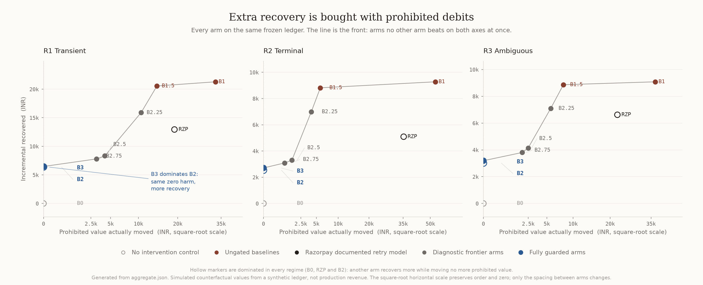
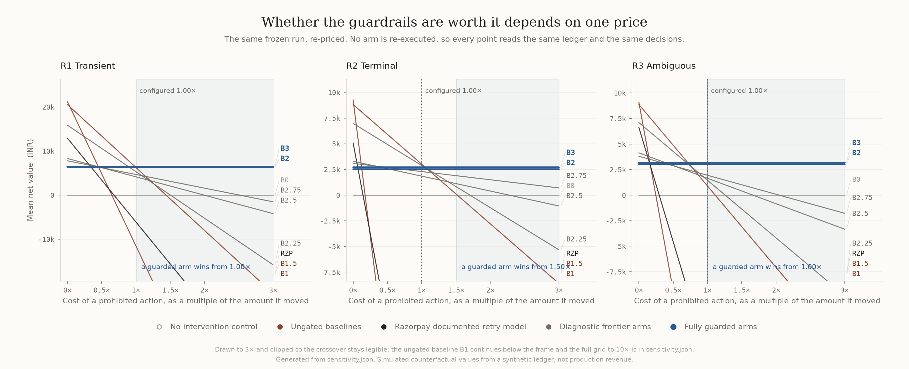

# MandateGuard

**Recover failed scheduled UPI AutoPay payments. Prove every action.**

Razorpay AI Buildathon · Track 03 — AI Revenue Recovery

MandateGuard helps merchants recover failed scheduled UPI AutoPay payments, with explicit controls for when to retry, when to stop, and when to ask a human—with evidence for every decision.

> **AI interprets unclear failure information; deterministic controls decide whether an action is allowed.**

The submission is intentionally focused. It does not try to replace Razorpay's existing recovery products. It demonstrates a bounded recovery layer that makes one of three decisions—**retry, stop, or escalate**—and leaves inspectable evidence for each one.

**The batch results are synthetic, not merchant revenue.** Razorpay Test Mode evidence is shown separately. A Standard Payment Link fallback is not an AutoPay retry, and creating a link is not proof of captured payment.

## Judge it in three minutes

Python 3.11+:

```bash
pip install -r requirements.txt
python -m uvicorn api.index:app --host 127.0.0.1 --port 8765
```

Open `http://127.0.0.1:8765` and confirm the header says **Python engine connected**.

1. Click **Run recovery demonstration**.
2. Inspect the three cases:
   - **Retry is permitted** — eligible recovery, one bounded provider action, verified postcondition.
   - **Stop before the provider** — revoked mandate, zero provider calls.
   - **Ask a human before another action** — one attempted provider call, unknown postcondition, no blind repeat.
3. Open a decision receipt and run **Verify audit chain + tamper check**.
4. Read recovery beside **recoverable value forgone** and safety outcomes.
5. Inspect the separate Razorpay Test Mode proof.
6. Expand **Advanced policy evaluation** only for the nine-policy benchmark and complete price sweep.

On Windows, `run_showcase.bat` launches the same judge-facing application.

## What the system proves

| Question | Inspectable answer |
|---|---|
| Can it recover? | A fixed 100-case synthetic batch records recovery only after simulated provider execution and postcondition evidence. |
| Can it stop safely? | Denied and abstained paths prove `provider_calls = 0`. |
| What if a write times out? | `UNKNOWN_POSTCONDITION` routes to human review before another automated action. |
| Can AI move money? | No. The interpreter has no provider tools and cannot widen deterministic authority. |
| Can the evidence be checked? | Receipts carry hashes, call IDs, idempotency data, postconditions and an audit chain; browser tamper tests recompute it. |
| Is any provider evidence real? | A separate saved Razorpay Test Mode fallback is bound to independently verified captured-payment evidence. |
| Are trade-offs hidden? | No. Recovery, protected value, realized harm and legitimate recovery forgone are reported separately, with a full price sweep. |

## Measured recovery

<!-- BEGIN GENERATED SUBMISSION METRICS -->
<!-- Generated by scripts/build_showcase.py from outputs/showcase_batch.json and outputs/manifest.json. -->
The interactive example uses **100 cases**, seed **1701**, transient regime, guarded B3 workflow.

| Measured in the demo batch | Result |
|---|---:|
| Simulated recovered INR | 7,944 |
| Simulated provider calls | 18 |
| Cases routed to human review | 6 |
| Protected value by denial, synthetic INR | 26,856 |
| Legitimate recovery forgone, synthetic INR | 29,054 |
| Realized harm, synthetic INR | 0 |

The final evaluation covers **54,000 policy decisions** across **20 seeds**, **3 regimes**, and **9 policies**.
<!-- END GENERATED SUBMISSION METRICS -->



**There is no universal winning policy.** Reason-only retry can recover more while executing prohibited value. Full guardrails can forgo legitimate recovery. The preferred arm changes with the assumed cost of an unsafe action, so the complete price curve is part of the evidence rather than an appendix we hide.



## Architecture in one screen

```text
Scheduled AutoPay failure
        |
        v
authenticate raw event -> normalize -> diagnose
        |                            |
        |                      ambiguous only
        |                            v
        |                    bounded interpreter
        |                      label + confidence
        |                            |
        +----------------------------+
                     |
                     v
        deterministic authority + guardrails
             |                  |
        deny/abstain          allow
             |                  |
       zero provider calls       v
             |           idempotent provider action
             |                  |
             +-------> postcondition / human review
                                |
                                v
                    tamper-evident decision receipt
```

The authority layer checks mandate state, consent, retry budget, timing, pre-debit notice, action class, amount ceiling and authority expiry before the provider boundary. Raw webhook bytes are authenticated with HMAC-SHA256 before normalization. Duplicate, stale and out-of-order deliveries are handled explicitly; `tests/test_webhook_ingress.py` attacks this boundary 42 ways.

## Why this is differentiated

Razorpay already ships recovery products. MandateGuard is a narrow recovery prototype, not a recovery engine deployed on production merchants.

The contribution is not “an LLM that retries payments.” Mature recovery products already exist, and other agents can also keep payment authority deterministic. MandateGuard concentrates on the **trust layer around recovery policy**:

- every policy runs on the same frozen common-outcome ledger;
- unsafe non-actions are first-class results with zero-call evidence;
- unknown provider outcomes are not mislabeled as failures and retried blindly;
- all nine policies expose recovery *and* the cost of restraint;
- an independent checker and mutation tests challenge the safety implementation;
- the bounded interpreter is adversarially tested and cannot authorize execution;
- saved Razorpay Test Mode evidence is separated from the synthetic benchmark;
- Payment Link capture is independently verified rather than inferred from link creation.

`docs/competitive_position.md` records the public competitive research and the conditions that would weaken this position.

## Policy and metric contract

Canonical policy order: **B0, B1, B1.5, RZP, B2.25, B2.5, B2.75, B2, B3**.

| Policies | Role |
|---|---|
| B0 | No-intervention control |
| B1 / B1.5 | Ungated retry / deterministic reason-only retry |
| RZP | Fixed temporal reference derived from a published **card** schedule |
| B2.25 / B2.5 / B2.75 | Diagnostic frontier relaxations; not safe production defaults |
| B2 / B3 | Full deterministic guardrails / same guardrails with bounded interpretation |

**RZP does not reproduce Razorpay's current Intelligent UPI Retry Engine.** Applying a card schedule to this synthetic AutoPay ledger is an explicit benchmark assumption.

| Metric | Meaning |
|---|---|
| `incremental_recovered_inr` | Simulated recovery above no intervention |
| `legitimate_recovery_forgone_inr` | Latent recoverable value on cases with no provider action |
| `protected_value_by_denial_inr` | Prohibited value associated with actions not sent |
| `realized_harm_inr` | Prohibited value on actions that reached the simulator |

Financial attribution depends on actual provider execution, not the symbolic name of a final action.

## Reproduce the evidence

Required submission path:

```bash
bash scripts/test.sh
bash scripts/demo.sh
bash scripts/evaluate.sh
```

Full verification:

```bash
python scripts/build_showcase.py
python scripts/recoverytruth_check.py
python scripts/security_regression_check.py
python scripts/hardening_check.py
python scripts/claims_check.py
python scripts/mutation_check.py
bash scripts/verify_all.sh
```

`evaluate.sh` regenerates benchmark data, charts and findings. `build_showcase.py` exports browser evidence and regenerates only the numeric README block above. `SHA256SUMS.txt` binds the shipped release files. Rendered PNG bytes can differ across Matplotlib/font environments, so verification preserves shipped charts while generation remains a separate step.

## Evidence map

| Start here | Purpose |
|---|---|
| [`SUBMISSION_READINESS.md`](SUBMISSION_READINESS.md) | Canonical final submission report and verification matrix |
| [`docs/JUDGE_RUNBOOK.md`](docs/JUDGE_RUNBOOK.md) | Fastest judge/reviewer path |
| [`ARCHITECTURE.md`](ARCHITECTURE.md) | Authority, execution and evidence boundaries |
| [`RECOVERYTRUTH.md`](RECOVERYTRUTH.md) | Razorpay Test Mode execution proof boundary |
| [`outputs/report.md`](outputs/report.md) | Generated benchmark appendix |
| [`ROBUSTNESS.md`](ROBUSTNESS.md) | Fixture-assumption sensitivity |
| [`VIDEO_SCRIPT.md`](VIDEO_SCRIPT.md) | Canonical five-minute pitch |
| [`docs/panel_qa.md`](docs/panel_qa.md) | Short answers for technical follow-up |

## Production boundary

This is a submission-grade prototype, not a merchant-production payment service.

Production merchant traffic still requires durable event/state/idempotency storage, transactional worker claims, merchant authentication and tenant isolation, managed secrets, approved provider capabilities, durable scheduling and cancellation, cross-process reconciliation, evidence retention/access controls, and validation on permissioned real failure data. The local simulator and process-local middleware do not claim distributed exactly-once execution.

The optional real-model artifact proves an integration path; it does not establish production model accuracy or measured recovery uplift.

**MandateGuard: recover deliberately. Stop when authority ends. Escalate uncertainty. Leave evidence.**
